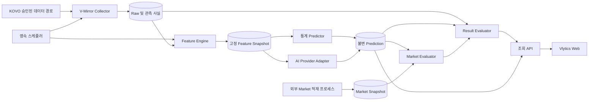

# 기술 설계

작성일: 2026-09-19 · 상태: 구현 준비안, 사용자 결정 전

## 설계 기준과 결정 경계

[원문](../ideas/vlytics.md) 10절의 확정 사항을 우선한다. [검토 의견](../ideas/vlytics-claude-feedback.md)은 설계 근거와 제안이며 승인된 범위 변경이 아니다. 특히 화면·Market·점수 모델의 후순위화, AI 보정자 전환, T-10분 재시도는 [사용자 결정](./user-confirm.md)의 Pending 항목이다. 원문 MVP 전체 기능을 삭제하지 않는다.

검토 의견의 API 경로, 22시즌 4,460경기, Elo 63.6%, 2026-27 개막일, 구단 코드 변경과 이용조건은 **제공 문서의 2026-09-19 관측 보고**다. 이번 준비 작업에서 외부 재조회·원자료 재계산하지 않았다. 구현 전 계약 조사로 검증하며 특정 건수·성능을 합격값으로 하드코딩하지 않는다.

## 구조 개요



확정된 논리 계층은 V-Mirror → V-Engine → Web이다. 추천 물리 구조는 단일 배포의 모듈형 모놀리스다. API와 worker를 같은 이미지에서 서로 다른 프로세스로 실행하고 한 PostgreSQL 안의 `mirror`, `engine`, `market`, `ops` 스키마로 소유권을 나눈다. 프로세스 실패 격리는 유지하지만 서비스 간 네트워크·분산 트랜잭션을 초기부터 도입하지 않는다. 이는 UC-003 승인 전까지 추천안이다.

## 기술 스택과 선택 이유

| 영역 | 추천안 | 이유·제약 |
|---|---|---|
| 분석/서버 | Python + FastAPI, 데이터 검증 모델 | 통계 계산과 Provider 어댑터를 한 언어로 연결, OpenAPI 계약 생성 |
| 저장 | PostgreSQL, SQL 마이그레이션 | FK·트랜잭션·스키마 권한·작업 lease·불변 제약을 일관되게 적용 |
| Raw/응답 | 처음에는 DB JSON/텍스트 + 해시, 크기 증가 시 비공개 object storage | 소규모 운영 단순화, 바이트 원문과 파싱본 구분 필요 |
| Web | React + TypeScript, 브라우저 SPA | 운영 조회/필터/비교, 정적 UI 시안에서 실제 API 연결 |
| 스케줄 | DB 영속 작업 큐 + 전용 worker | 재시작·중복 실행·연기 처리, 시스템 시간과 lease 관찰 가능 |
| 배포 | 상시 실행 호스트 + API/worker/Postgres, UTC 저장 | 개인 PC 절전/종료로 인한 누락 최소화; 실제 호스트·비용 미정 |

패키지·런타임 버전은 구현 시작 시 지원 상태를 확인해 lockfile로 고정한다. 클라우드 업체, 별도 Redis, Kubernetes, 관리형 AI 라우터는 확정하지 않는다. GitHub Actions는 CI 후보이며 T-60 실행 시각을 보장하는 운영 스케줄러로 가정하지 않는다.

## 컴포넌트 책임

| 모듈 | 소유 데이터·책임 | 금지 경계 |
|---|---|---|
| Collector/Parser | 원문 저장, 계약 검증, 변경 탐지, 정규화 revision 생성 | 원문 덮어쓰기, 분석 값을 원천 사실로 저장 |
| Identity Resolver | 팀/선수 source key, 구단 연속성, 시즌별 명칭·경기장 | 이름 유사성만으로 자동 병합 |
| Feature Engine | as-of 조회, 계산식/윈도/결측 상태, 입력 lineage | 현재 누적 순위를 과거 feature로 사용 |
| Statistical Predictor | 버전 고정 통계 모델과 분포 출력 | Market 입력 접근 |
| AI Adapter | 같은 snapshot 직렬화, timeout/검증/사용량 기록 | 검색 도구, Market 입력, 임의 응답 보정 |
| Market Evaluator | 고정 라인·계약으로 파생 확률과 정산 | 원래 분포 변경, 원천 배당 수집 |
| Result Evaluator | 결과 revision별 평가와 비교 cohort 생성 | prediction 수정, 사후 실패 표본 삭제 |
| Scheduler | 일정 revision별 작업 등록·lease·재시도·복구 | 고정 요일/하루 경기 수 가정 |
| Query API/Web | 읽기 모델, 명확한 유효성/표본/결측 표시 | 화면에서 성능·확률을 독자 재계산 |

## 예상 디렉터리 구조

아래는 UC-003 채택 시 생성할 구조다. 현재는 문서와 UI 시안만 만든다.

```text
backend/
  src/vlytics/
    mirror/            # collectors, parsers, identities, repositories
    engine/            # features, predictors, providers, market, evaluation
    ops/               # scheduling, jobs, configuration, diagnostics
    api/               # read routes, operator commands, response contracts
  tests/               # unit, contract, integration, replay
  migrations/
frontend/
  src/                 # today, match, history, performance, operations
contracts/             # versioned feature, prediction, market schemas
fixtures/synthetic/    # fabricated, redistribution-safe contract fixtures
infra/                 # local compose and selected production configuration
docs/prepare/
```

## 데이터 모델

모든 내부 PK는 UUID, 시각은 `timestamptz` UTC, 화면은 Asia/Seoul이다. source ID는 문자열로 보존해 선행 0을 잃지 않는다. 아래 열은 구현 계약의 최소안이며 미확인 KOVO 응답을 사실로 가정한 SQL 확정본이 아니다. 원천 키의 실제 유일성은 UC-002 조사로 확인한다.

### V-Mirror

| 엔터티 | 주요 필드·제약 |
|---|---|
| `seasons` | `id, source, source_season_code, label, starts_at, ends_at`; source+code unique |
| `competitions` | `id, source_competition_code, division, stage`; division=`men/women`, stage는 정규/PO/챔프/기타 |
| `franchises` | `id`; 통계적 연속성은 별도 버전 있는 mapping/이월 정책 |
| `team_identities` | `id, source_team_code, season_id, franchise_id, display_name, valid_from, valid_to, observed_at, mapping_version`; 시즌+source code unique |
| `players` / `roster_revisions` | source+선수 code unique; roster는 team/player/유효 기간/관측 시각/원문 ID, 교체를 기존 행 수정 없이 기록 |
| `venues` | `id, source_venue_code, name`; 실제 경기장은 경기 revision에서 참조 |
| `matches` | `id, source, season_id, competition_id, source_match_code`; 복합 source key unique, 이름/날짜를 식별자로 쓰지 않음 |
| `match_revisions` | `id, match_id, revision, home_team_id, away_team_id, venue_id, scheduled_start_at, actual_start_at, status, observed_at, raw_snapshot_id`; match+revision unique |
| `raw_snapshots` | `id, source, request_fingerprint, redacted_url, received_at, status_code, body_bytes_or_private_uri, sha256, parser_version`; 같은 내용도 관측 이벤트는 보존 |
| `result_revisions` | `id, match_id, revision, home_sets, away_sets, home_points, away_points, finality, observed_at, raw_snapshot_id`; 정정은 새 revision |
| `match_sets` | `result_revision_id, set_number, home_points, away_points, duration_seconds?`; result+set unique |
| `team_match_stats` / `player_match_stats` | result revision + team/player unique; metric schema version, 실제 확인한 시도/성공/범실만 typed 필드로 승격 |
| `source_coverage` | 시즌/종목/경기/데이터종류별 `available/missing/not_supported/unverified`, 조사 근거와 관측 시각 |

`player_set_stats`와 랠리 테이블은 소스가 확인될 때만 생성한다. `ynS1` 등의 의미를 출전/세트 기록으로 추측해 매핑하지 않는다. 결측은 0과 다르며 원문에 없는 수치를 채우지 않는다. 최종 경기 검증은 세트 승리 합, 양 팀 누적 점수와 세트 점수 합, 승자 일치, 허용 세트 수를 확인하고 특례 경기/몰수는 별도 규칙으로 격리한다.

### V-Engine·Market·운영

| 엔터티 | 주요 필드·제약 |
|---|---|
| `feature_snapshots` | `id, match_id, schedule_revision_id, cutoff_at, captured_at, feature_version, availability_policy, lineup_status, values_json, lineage_json, sha256`; immutable |
| `model_variants` | `id, provider, requested_model, pinned_model_version, prompt_version/hash, feature_version, output_schema_version, hyperparameters, experiment_group`; 내용 변경은 새 ID |
| `prediction_attempts` | `id, job_id, snapshot_id, variant_id, started_at, completed_at, status, error_code, request_hash, response_hash/private_body, usage, latency_ms`; 시도마다 새 행 |
| `predictions` | `id, match_id, schedule_revision_id, snapshot_id, variant_id, stage, input_cutoff_at, started_at, generated_at, resolved_model_id, output_json, market_snapshot_id?, sha256`; snapshot+variant+stage unique, insert-only |
| `prediction_events` | `id, prediction_id, event_type, reason, occurred_at, observed_at, superseding_prediction_id?, schedule_revision_id?`; append-only, 상태는 projection으로 계산 |
| `market_snapshots` | `id, match_id, source, source_event_id, quoted_at, observed_at, received_at, contract_version, markets_json, sha256`; immutable |
| `market_evaluations` | `id, prediction_id, market_snapshot_id, evaluator_version, derived_probabilities, eligibility, reason`; prediction/market/version unique |
| `evaluations` | `id, prediction_id, result_revision_id, evaluator_version, cohort_policy_version, metric_values, settlement`; 해당 조합 unique, 정정 시 새 행 |
| `jobs` / `job_attempts` | job unique key, due_at, deadline_at, state, lease_owner/until, attempt_no, error_code; mutable 큐와 append-only 시도 로그 분리 |
| `audit_events` | actor/action/object/reason/correlation_id/time; 운영 재실행·설정 변경 기록, 비밀정보 제외 |

`predictions`의 `status` 열을 UPDATE하는 방식은 쓰지 않는다. 생성 예측은 그대로 두고 `published`, `voided`, `superseded`, `late_rejected` 이벤트를 추가한다. projection은 언제든 재구축 가능한 캐시이며 원본이 아니다. DB 서비스 계정에 prediction/raw/feature/evaluation UPDATE·DELETE 권한을 부여하지 않고 방어용 트리거 및 통합 테스트를 둔다. 변경 가능한 운영 큐에는 이 제약을 적용하지 않는다. 외부 object 저장 시 private immutable key와 DB hash를 함께 검증한다.

## 시점·누수 방지 계약

1. 목표 시각 `T = schedule_revision.scheduled_start_at`, 입력 기준 `cutoff_at = T - 60 minutes`를 사용한다. `captured_at`은 실제 저장 시각으로 별도 기록한다.
2. live feature는 경기 사실이 cutoff 이전에 발생했고, 채택한 revision의 `observed_at <= cutoff_at`인 데이터만 사용한다. 조회 당시 최신 revision을 무조건 선택하지 않는다. 이전 경기의 결과 확정 여부와 데이터 가용시각도 검사한다.
3. T-60 직후 수집해 처음 관측한 정보는 T-60 입력에 들어갈 수 없다. 주기적 선행 동기화로 cutoff 이전 관측을 확보하고 직후 수집은 향후 입력용이다. cutoff 직전에 명단이 없으면 `lineup_status=unknown`으로 실행한다.
4. 경기 후 확인한 실제 출전 명단, 이후 경기, 시즌 최종 누적 순위, 결과를 반영한 배당은 입력에서 제외한다. 전체 시즌 계산 후 행만 잘라내는 feature pipeline도 금지한다.
5. snapshot에는 계산된 feature 값, 각 source revision ID/hash, 포함 경기 ID, 계산 버전, 결측 이유를 저장한다. 이후 원천 정정에도 snapshot을 재계산하거나 덮어쓰지 않는다.
6. 현재 backfill의 `observed_at`은 **현재 수집 시각**이다. 과거 경기 시각으로 소급해 쓰지 않는다. 따라서 진짜 point-in-time 과거 관측 기록이 없다면 strict as-of 백테스트는 불가능하다.
7. 과거 실험은 `historical_reconstruction`으로 구분하고 "당시 확정됐을 것으로 가정한 경기 단위 기록만 사용, 정정/공개 지연은 복원 불가"라는 availability policy를 붙인다. 이 결과를 `live_prospective`와 합산하지 않는다. 당시 관측 자료가 있는 구간만 `historical_point_in_time`으로 별도 검증한다(UC-009).
8. AI 과거 실행은 형식/연결 점검용 `retrospective_diagnostic`이며 예측력 증거로 쓰지 않는다. 모델 학습 시점과 지식 오염을 완전히 확인하기 어려우므로 실제 경기 전 생성된 live 예측을 주 평가로 사용한다.

## 예측 분포와 계산 계약

UC-004 승인 대상인 추천 공통 계약이다. Elo 단독은 승패만 지원하므로 미지원 target을 `unsupported`로 표시하고 6범주 분포를 임의 생성하지 않는다. 세트 모델 및 점수 모델을 추가해야 원문의 전체 예측 범위를 충족한다.

`PredictionOutputV1`은 `capabilities`, `home_win_probability?`, `set_score_probabilities?`, `joint_score_distribution_ref?`, `rationale`, `risk_factors`, `confidence_note?`를 갖는다. 확률은 유한수 `[0,1]`, 6개 합은 `abs(sum-1) <= 1e-6`을 검증한다. 허용 오차 내 반올림 보정만 정해진 규칙으로 수행하고 원문·보정 여부를 보존한다. 범위 위반/누락은 실패이며 자동으로 균등 분포로 바꾸지 않는다. 승패와 세트분포가 모두 있으면 일치 여부를 검증하고 화면의 값은 세트분포에서 계산한다. confidence는 보정된 확률처럼 사용하지 않는다.

홈 관점 세트 결과 키는 `3:0, 3:1, 3:2, 2:3, 1:3, 0:3`이다. `p_s`가 각 결과 확률, `H_s/A_s`가 홈/원정 세트 수일 때:

- `P(home_win) = p_3:0 + p_3:1 + p_3:2`.
- `P(set_cover, h) = Σ p_s · I(H_s - A_s + h > 0)`, push는 `=0`, fail은 `<0`. `h`는 **홈 점수에 더하는** handicap이다.
- 세트 수 O/U: `P(over, l) = Σ p_s · I(H_s + A_s > l)`; under와 push를 각각 계산한다.
- 점수 O/U는 총점 `U = home_points + away_points` 분포가 필요하다.
- 점수 handicap은 득실차 `D = home_points - away_points` 분포가 필요하다. **세트스코어+총점 분포만으로 점수 handicap 확률을 도출할 수 없다.** 검토 의견의 "어떤 라인이든 cover 계산" 표현을 그대로 채택하지 않는다.
- 전체 일관성을 위해 `P(set_score, home_points, away_points)` 또는 유효한 세트별 스코어 시뮬레이션으로 공동분포를 생성한다. 여기서 세트분포·총점·득실차를 주변화한다. 경험적 세트 수별 총점 모델만 있는 단계는 O/U만 지원하고 점수 handicap은 `unsupported`다.
- 공동분포의 남녀별 parameter version, 학습 구간, 샘플 수/seed, tail 처리와 Monte Carlo 오차를 기록한다. 세트 종료 규칙(일반 25점/5세트 15점과 2점 차) 및 시즌별 예외는 데이터 계약으로 확인한다.

세트 독립 baseline 후보: 1~4세트 홈 승률 `p`, 5세트 홈 승률 `p5`이면 홈 `3:0=p³`, `3:1=3p³(1-p)`, `3:2=6p²(1-p)²p5`; 원정은 `0:3=(1-p)³`, `1:3=3(1-p)³p`, `2:3=6p²(1-p)²(1-p5)`. 6개 합/대칭성을 검증하고 남녀별 순차 검증으로 독립 가정의 한계를 측정한다.

Elo 후보는 `P(home)=1/(1+10^((R_away-R_home-home_advantage)/400))`, 경기 후 `R_home += K·weight·(y-p)`, 원정은 반대 변화다. 검토 의견의 초기 1500, K=32, home +15, 세트차 weight 1.25/1/0.75, 시즌 회귀 0.5는 **재현 후보**다. 이월은 `R_new=1500+(1-rho)(R_old-1500)`로 정의하고 franchise mapping/신생팀 처리와 함께 버전 관리한다. 검증 구간을 다시 튜닝에 사용하면 새로운 holdout을 지정한다.

## 인터페이스

```text
Collector.fetch(request, permission_policy) -> RawReceipt
Parser.parse(raw_receipt, parser_version) -> FactRevisionBatch | ContractError
FeatureBuilder.build(match_id, schedule_revision_id, cutoff_at, policy) -> FeatureSnapshot
PredictionProvider.predict(context: PredictionContextV1, timeout_ms) -> PredictionOutputV1
MarketEvaluator.evaluate(prediction_id, market_snapshot_id, contract_version) -> MarketEvaluation
ResultEvaluator.evaluate(prediction_id, result_revision_id, policy_version) -> Evaluation
```

`PredictionContextV1`은 snapshot ID/hash, cutoff, 남녀/대회 구분, 팀/선수 feature와 결측 상태, feature version을 포함한다. Market 필드/배당/다른 모델 예측은 독립 실험군 입력에서 제외한다. 통계 모델 결과를 입력받는 보정 실험군은 UC-006 승인 이후 별도 `experiment_group=calibrator`로만 추가한다. Provider별 직렬화 차이는 허용하되 의미상 같은 입력과 prompt/hash를 보존한다. 도구·검색은 기본 비활성화한다.

Provider 결과에는 requested/resolved 모델 ID, version, 요청/응답 해시, 비공개 원문, temperature/seed(지원 시), token usage, latency, provider request ID, safety refusal/validation failure가 추적 가능해야 한다. 날짜 고정 모델 ID가 없으면 `version_unverified`로 cohort를 구분하고 silent alias 변경을 같은 버전으로 합산하지 않는다.

### 조회/운영 API 초안

| 메서드·경로 | 계약 |
|---|---|
| `GET /api/v1/matches?date=&division=&stage=` | KST 날짜를 서버에서 UTC 구간으로 변환, 일정 revision·지연·coverage 반환 |
| `GET /api/v1/matches/{id}` | 일정/결과 revision, 예측별 입력 cutoff·생성 시각·모델·상태·Market 가용성 |
| `GET /api/v1/predictions?cursor=&division=&variant=&from=&to=` | 안정된 cursor, total eligible/failed 구분, 응답에 schema version |
| `GET /api/v1/predictions/{id}` | 보존된 결과/근거/lineage 요약·상태 이벤트; 원문과 키는 반환하지 않음 |
| `GET /api/v1/performance?cohort=&division=&stage=&variants=` | 평가 cohort, 공통 경기 수, 제외 사유, metrics/CI/calibration, 결과 revision 기준 |
| `GET /api/v1/operations` | jobs·실패·최근 동기화·clock skew·coverage·누락 예측 |
| `POST /api/v1/jobs/{id}/retry` | 운영자 인증, idempotency key 필수, cutoff/마감 검증; 과거 예측 교체 불가 |

오류는 `{code, message, retryable, correlation_id}`로 통일하고 비밀정보/Provider 원문을 노출하지 않는다. 인증 실패 401/403, 잘못된 계약 422, 중복 충돌 409, upstream 일시 실패 503을 구분한다. UI의 타이밍·집계 정책은 서버 응답으로 결정한다.

## Market 계약

UC-005에서 실제 외부 적재자와 계약을 확정한다. 기존 DB가 없으면 합성 fixture로 어댑터를 검증할 수 있으나 시장 비교의 실제 완료로 간주하지 않는다.

각 라인은 `market_type=moneyline/handicap/total`, `unit=match/sets/points`, `period=full_match/set_n`, `selection`, `line`(정밀 decimal), `decimal_odds`, `settlement_rule_version`, `quoted_at`, `observed_at`, `source`를 포함한다. 홈/원정 방향과 handicap 부호, 양쪽 odds가 같은 계약/시점인지 검증한다. 지원 초기안은 full_match와 단일 정수/반점 라인이며 quarter line·부분 경기·몰수/중단·재개 특례는 명시적으로 지원하거나 `unsupported` 처리한다.

T-60 cutoff 이하의 quote/observation 중 최신의 유효 snapshot만 고정하고 `max_age` 초과 시 `stale`, 없으면 `missing`이다. 이후 배당을 과거 예측에 소급 연결하지 않는다. 적격 snapshot이 없더라도 독립 예측과 일반 평가를 계속한다. 실제 수신이 늦은 과거 quote는 당시 가용했다고 가정하지 않는다.

2-way decimal odds `o_h,o_a > 1`일 때 공정화 후보 `q_h=(1/o_h)/((1/o_h)+(1/o_a))`다. 서로 다른 라인이나 정산 계약을 섞지 않는다. push가 있는 시장의 implied probability는 조건부 승/패 의미를 명시하며, 무조건 승률과 직접 비교하지 않는다. 배당 마진 제거법도 버전 관리한다. ROI를 표시한다면 stakes, push/void, 수수료·배당 시점 포함 규칙을 먼저 정의해야 하며 초기 핵심 지표로 확정하지 않는다.

## 스케줄·상태 관리

일정 수와 요일을 고정하지 않는다. UTC clock을 쓰고 일정 polling, 결과 polling, 원천 요청 간격은 UC-002/003 승인 정책에서 설정한다.

| 대상 | 상태/전이 | 불변 조건 |
|---|---|---|
| 경기 | scheduled → live → provisional_final → final; postponed/cancelled; 이후 corrected revision | 관측된 상태 변경은 새 match/result revision |
| 작업 | pending → leased → succeeded 또는 retry_wait → leased; deadline 초과는 expired; 계약 실패는 quarantined | lease 만료 후 복구, unique job key로 중복 등록 방지 |
| Provider 시도 | started → valid/invalid/timeout/refused/late | 시도 기록은 삭제하지 않음 |
| 예측 공개 상태 | generated → published; 이후 voided/superseded 또는 late_rejected 이벤트 | prediction 본문 수정 금지 |
| 평가 | provisional → final → corrected evaluation revision | 원래 평가 보존, 최신/당시 결과 기준 조회 구분 |

job key는 `(match_id, schedule_revision_id, stage, variant_id)`이며 feature 작업은 variant 없이 같은 snapshot을 공유한다. 등록/lease 취득은 DB 트랜잭션으로 원자화하고 worker가 죽으면 lease 만료 후 재시도한다. 외부 AI 호출은 exactly-once를 보장할 수 없으므로 provider idempotency가 있으면 사용하고, 없으면 중복 비용을 로그에 남기되 결과 insert unique 제약으로 대표 prediction을 하나만 채택한다. 성공한 Provider를 다른 Provider 실패 때문에 재호출하지 않는다.

T-60은 확정된 목표 실행 시각이다. CPU/네트워크 지연으로 `started_at`과 `generated_at`은 cutoff와 다를 수 있다. 시간 허용 오차와 최종 retry deadline은 UC-007 Pending이다. 추천은 snapshot cutoff를 T-60으로 유지하고 제한된 grace로 `on_time`/`late_pregame` cohort를 나누는 안이다. T-10 제안은 승인 전 운영 기본값으로 적용하지 않는다. strict 시각 정책을 선택하면 해당 허용 오차를 넘는 시도는 diagnostics만 보존한다.

모든 정책에서 실제 시작 시각 이후 완료된 응답은 `late_rejected`, 주 성능 cohort 제외다. 요청이 경기 전에 시작됐어도 예외가 아니다. 실제 시작 시각이 미확인인 동안 예정 시작을 보수적 상한으로 쓰고, 이후 확인된 실제 시작이 더 빠르면 lifecycle 이벤트로 적격성을 철회한다. 나중에 시작한 사실을 근거로 사전 deadline을 임의 연장하지 않는다.

연기/시간 변경은 새 schedule revision을 생성한다. 기존 queued job을 취소하고 기존 예측에는 `voided` 또는 `superseded` 이벤트를 추가한다. 새 T-60이 미래이면 새 snapshot/job을 만들고, 이미 지났으면 누락/late 정책에 따라 처리하되 과거 입력을 만들어낸 것처럼 backdate하지 않는다. 경기 취소·중단·재개는 Market 계약과 평가 규칙에 따라 void/보류하고 재편성 매핑을 명시한다. 메타데이터만 정정한 경우 재예측 여부는 revision diff 정책으로 구분한다.

결과 동기화는 provisional 결과 검증 후 finality 정책에 따라 확정한다. 안정화 간격·정정 재조회 기간은 UC-007에서 결정한다. 결과 정정은 새 evaluation을 생성해 동일 cohort에 반영하고, dashboard에는 반영 기준 시각·정정 건수를 보여준다.

## 평가·실험 설계

`y=1`은 홈 승, `p`는 홈 승 확률이며 승자 선택은 `p>=0.5`이면 홈이라는 tie 규칙을 고정한다.

| 지표 | 정의·표시 규칙 |
|---|---|
| Accuracy | `Σ I(predicted_winner=y)/n`, 승패·세트스코어·Market별 eligible 분모를 각각 표시 |
| Brier | binary convention `mean((p-y)^2)`; 2배 합산 convention과 섞지 않음 |
| Log Loss | `-mean(y log p + (1-y) log(1-p))`; 수치 계산만 epsilon=1e-12 clipping, 원본 p 유지 |
| Set RPS | 약한 홈→강한 홈 순서 `[0:3,1:3,2:3,3:2,3:1,3:0]`, `mean(Σ(k=1..5)(F_k-O_k)^2/5)` |
| Calibration | 사전 고정 확률 구간의 평균 p, 실제 승률, 표본 n, 불확실성; 빈 구간 생략 표시 |
| Paired difference | 공통 적격 경기별 `d_i=loss_AI_i-loss_baseline_i`; 음수가 AI 우위. 평균, n, SD/sqrt(n)와 CI |
| Market 적중률 | 승/(승+패); push·void·missing·stale·unsupported의 개수는 별도 표시 |

표본 독립 가정의 정규 CI는 참고치다. 날짜/라운드 등 사전 지정 block bootstrap으로 팀/일정 상관을 고려한 CI를 병기할 수 있으며 방법·seed·반복 횟수를 저장한다. 작은 표본은 수치를 숨겨 유리한 항목만 보이지 말고 불확실성과 sample size를 표시한다. 여러 변형 비교의 탐색적 결과와 사전 등록된 비교를 구분한다.

기준선 추천은 훈련 기간 홈 승률 고정 모델, 통계 baseline, 적격 Market 내재확률 3종이다. 홈 승률도 평가 기간 결과로 추정하면 누수이므로 훈련 기간/online update 규칙을 고정한다. 시장 자료 없는 경기는 시장 비교 분모에 넣지 않되 AI 대 통계 전체 비교에서 제외하지 않는다. Provider failure rate와 예정 예측 대비 coverage도 성능 옆에 제공한다.

남녀, 정규/포스트시즌, feature/prompt/model version, availability policy, on_time/late, 결과 finality를 cohort key에 포함한다. 같은 경기·같은 cutoff/input 그룹만 짝비교한다. 순차 train/validation/test 분할과 walk-forward feature 계산을 사용하고 무작위 경기 분할을 하지 않는다. 피드백의 과거 기간과 점수는 재현 참고이며 성능 보장이나 공개 전환 수치가 아니다.

## 오류 처리·로그·설정

429/일시 5xx/네트워크 실패는 Retry-After 우선, 지수 backoff+jitter로 deadline 안에서만 재시도한다. 파싱 필수 필드 누락, source key 충돌, 확률 계약 실패는 격리하고 원문·version·error code를 보존한다. 한 경기 실패가 다른 경기/Provider를 막지 않는다. stale 입력으로 계속할지는 feature별 허용 정책과 coverage를 명시하며 누락을 성공으로 숨기지 않는다.

로그 공통 필드: correlation/job/match/schedule_revision/snapshot/variant/attempt ID, UTC 시각, error code, duration, 요청 개수, 상태 전이. 원문·인증헤더·키·전체 prompt는 일반 로그에 남기지 않는다. 지표: 수집 성공률/지연, 데이터 coverage, T-60 작업 지연, 만료 작업, provider별 실패·token·예산, final 결과 대기, prediction/evaluation 수, clock skew. 알림 채널은 운영 환경 결정 후 연결한다.

설정은 timezone, source permission policy, request rate, concurrency, poll intervals, parser/feature/model/prompt versions, timeout/deadline, max_market_age, result finality, daily/monthly AI budget, backup retention으로 분리한다. 설정 해시를 실행마다 기록한다. 예산 초과 시 AI 시도를 `budget_skipped`로 기록하고 통계 예측을 계속한다. 외부 적재 Market의 장애가 독립 예측을 멈추지 않게 한다.

## 외부 의존·보안

KOVO 비문서 API, 외부 Market 적재자, AI Provider, 상시 호스트와 시계 동기화가 외부 의존이다. UC-002 해결 전에는 제공 문서/합성 fixture와 허용 범위 확인을 진행하며 대량 수집을 실행하지 않는다. robots 404나 무인증 응답은 자동수집·재배포 허가의 증거가 아니다.

개인용이라도 API/운영 명령은 인증된 운영자만 접근한다. 기본은 loopback 또는 private network이고 public ingress는 별도 승인한다. DB 역할을 collector/engine/market_ingest/read_api/migration으로 나누고 V-Mirror 사실을 엔진이 수정할 수 없도록 한다. 비밀정보는 런타임 secret store/env에서 주입하되 `.env`, DB dump, raw JSON, Market 실자료, provider 원문은 저장소에 커밋하지 않는다. 공개 저장소 fixture는 합성 데이터만 사용한다. AI 응답/외부 문자열은 HTML로 직접 렌더링하지 않는다.

## 테스트·빌드·배포 전략

1. 계약: 합성 응답으로 source key, 필수 필드 누락, UTF-8/소수/빈 값, source code 선행 0, parser version 변경을 검사한다. 사용 허가된 샘플만 비공개 통합 fixture로 사용한다.
2. 시점: cutoff 직전/직후 관측, 이후 정정, 과거 backfill을 as-of로 오인한 경우, 확정 전 결과/실제 출전 명단 누수를 검출한다.
3. 수학: 6개 확률 합·대칭·승패 주변화, 세트/점수 handicap 부호, push, 총점만으로 point cover 미지원, 공동분포의 주변화/꼬리 질량을 검증한다.
4. 불변성: DB UPDATE/DELETE 거부, lifecycle event로 void/supersede, 결과 정정 뒤 이전 snapshot/hash 불변을 검사한다.
5. 운영: 같은 job 동시 claim, lease 만료, AI timeout 후 늦은 응답, Provider 부분 실패, 연기/취소/앞당김, 재시작과 deadline 복구를 fake clock으로 검증한다.
6. 평가: 손계산 가능한 synthetic cohort로 Brier/Log Loss/RPS, 공통 경기 교집합, missing/void 분모, 남녀 분리, corrected evaluation projection을 확인한다.
7. 전체 흐름: 합성 시즌 일정 재생 → T-60 고정 → 통계/가짜 Provider → 독립 결과 저장 → Market 후행 → 최종/정정 평가 → Web 필터를 검증한다. 과거 AI 호출은 성능 평가로 보고하지 않는다.
8. 실제 운영 전: 선정 환경에서 clock/재시작/예산/백업 복구 drill, 승인된 소량 소스로 계약 점검, 실제 경기 전 dry run을 수행한다.

CI는 lint/type check, unit/contract/integration test, frontend production build, migration 검사다. DB migration은 staging 백업/복구 검증 후 운영 적용한다. worker와 API는 같은 버전 이미지를 사용하고 schema 호환 순서를 지킨다. 백업 주기·RPO/RTO·보관 기간은 UC-003에서 승인하며 복구 테스트 없이 "백업 완료"로 판단하지 않는다.

## 기술 위험과 구현 게이트

| 위험 | 대응·게이트 |
|---|---|
| 수집 권한/범위 미확인 | UC-002; read-only 조사와 bulk execution 구분 |
| 과거 관측 시각 부재 | UC-009; reconstruction 표기, live와 분리 |
| 시장 단위·정산 불명 | UC-005; unsupported/missing을 결과로 표현 |
| Elo만으로 전체 예측을 충족 못함 | UC-001/004; 세트/공동점수 모델 또는 명시적 단계 승인 |
| 모델 alias/지식오염 | UC-006; 버전 cohort, 전향 평가 |
| T-60과 T-10 정책 충돌 | UC-007; cutoff/완료 시각/late cohort 구분 |
| 공개 서비스 조건 미정 | UC-010 Deferred; 개인용 준비에 공개 승인 가정 금지 |

구현 단계의 작업·의존·검증은 [plan.md](./plan.md)에 연결한다. Pending 영향 작업은 문서의 추천안을 확정 설정으로 옮기기 전에 해당 결정을 받아야 한다.
