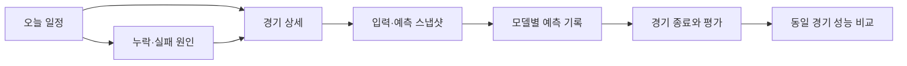

# Design

작성일: 2026-09-19 · 상태: 구현 준비안, 사용자 결정 대기

## Overview

Vlytics는 개인 운영자를 위한 V리그 데이터·예측 실험 플랫폼이다. V-Mirror → V-Engine → Vlytics Web 구조로 남녀부 데이터를 축적하고 경기 전 예측을 변경 불가능한 기록으로 보존하여 경기 후 성능을 검증한다.

이번 산출물은 기획·설계·비교 시안·실행 계획이다. 제품 기능, 실제 데이터 수집, AI 유료 호출, 배포는 수행하지 않는다. [architecture.md](architecture.md), [user-confirm.md](user-confirm.md), [plan.md](plan.md) 순으로 읽는다.

### 근거와 결정의 우선순위

`docs/ideas/`의 문서 2개를 재귀 목록으로 확인하고 모두 분석했다.

| 근거 | 지위 | 반영 |
|---|---|---|
| [vlytics.md](../ideas/vlytics.md), v0.1, 2026-09-19 | 원안 10절은 기존 확정 사항 | 3계층, 양 리그, T-1h, 독립 예측, 네 예측 유형, Provider 교체, 개인용 MVP 유지 |
| [vlytics-claude-feedback.md](../ideas/vlytics-claude-feedback.md), 2026-09-19 | 검토자의 측정 보고 및 제안 | 시점·식별자·짝비교 위험을 설계에 반영. MVP 축소와 모델 변경은 승인 대기 |

검토 문서의 4,460경기, Elo 63.6%, Brier 0.2232 및 10월 31일 개막은 이번 작업에서 재현하지 않은 보고값이다. 데이터 파일·실험 코드가 없어 수집 완료 기준이나 고정 출시일로 쓰지 않는다. 실제 일정과 완전성은 TASK-001에서 다시 확인한다. 약관의 자동수집 허용 여부 역시 확정하지 않는다.

### 충돌·제안 추적

| 이슈 | 원안과 검토 의견 | 처리 |
|---|---|---|
| MVP 범위 | 네 예측+Web 포함 / 기록 파이프라인 우선 | UC-001. 원안 범위를 삭제하지 않고 단계적 출시안을 제시 |
| 시장 독립성 | 라인 없이 핸디캡·O/U도 예측 / 분포를 출력하고 코드로 판정 | UC-004·005. 승패·세트 분포와 라인 판정 분리 권고 |
| AI 역할 | 독립 예측 / 보정·설명·뉴스 입력 대안 | UC-006. 독립 예측은 유지, 확장 실험은 승인 전 비활성 |
| 실행 시점 | T-60분 / T-10분까지 재시도 | UC-007. 늦은 실행을 정시 코호트에 섞지 않음 |
| 세트별 선수 기록 | 후보 테이블 / 확인한 응답에는 없음 | UC-002. 확보 전 입력 필수조건이나 완성 기능으로 약속하지 않음 |
| 과거 백테스트 | 충분한 과거 데이터 / AI 학습오염 위험 | 통계 backtest와 AI 전향 평가를 분리하는 설계 권고 |

## Problem

매번 원천 사이트를 조회하면 입력 시점, 정정 이력, 모델 버전이 남지 않는다. 그러면 예측 당시 알 수 없었던 정보를 사용하거나, 결과를 본 뒤 기록을 바꾸거나, 쉬운 경기만 성공한 모델을 우수하다고 평가하기 쉽다. 기록을 모으는 것과 예측력이 개선되었음을 입증하는 것은 별개다.

## Goals

1. 원천 응답과 정규화 버전을 연결하여 재처리 가능하게 만든다.
2. 동일 경기·동일 입력·동일 실행 구간의 모델을 비교한다.
3. 예정·실패·지연·누락을 성공 예측과 함께 기록한다.
4. 승패, 세트스코어, 핸디캡, O/U의 지원 여부와 근거를 명시한다.
5. 표본 수, 확률 점수, 기준선 대비 차이로 개선을 판단한다.

## Non-Goals

Market/Odds 자체 수집, 베팅 실행, 수익 보장, 유료 서비스, 공개 회원 시스템, 고급 Ensemble, 랠리 복원, 모델 자동 선택은 이번 MVP 준비 범위에서 제외한다. 공개 전환은 UC-010 Deferred다.

## Target Users

운영자는 경기 전 누락 여부를 확인하고, 경기 후 예측과 실제 결과를 감사하며, 장기간 모델·Feature·Prompt 버전을 비교한다. 공개 방문자·회원 역할은 아직 만들지 않는다.

## Core Concept

하나의 경기 일정 revision에 하나의 입력 스냅샷을 고정하고 여러 모델이 이를 독립적으로 읽는다. Market은 예측 입력 밖에 있고 예측 후 비교에만 사용한다. 예측은 불변이고 평가·취소·정정은 새 이벤트나 버전으로 추가한다.

## User Scenarios

| 시나리오 | 운영자의 질문 | 완료 상태 |
|---|---|---|
| 당일 준비 | 어떤 경기가 언제 실행되고 무엇이 누락됐는가? | 실제 일정 목록, 다음 실행, 동기화 상태가 보임 |
| 경기 전 확인 | 입력이 같고 시점이 지켜졌는가? | Snapshot ID, cutoff, 명단 상태, 모델별 성공/실패 확인 |
| 기록 감사 | 이 예측은 어떤 데이터와 버전으로 만들어졌는가? | 불변 입력·버전·응답·당시 Market 참조 추적 |
| 결과 검증 | 어떤 기준에서 어느 모델이 나았는가? | 동일 경기 짝비교, 표본과 제외 이유 확인 |
| 장애 대응 | 재시도해도 평가를 오염시키지 않는가? | 원 기록 보존, 별도 attempt, 마감 후 제외 상태 |

## User Flow

경기 없는 날은 오류가 아닌 빈 일정이다. 일정 변경은 이전 스냅샷을 무효화하는 별도 사건으로 보여주고 새 revision으로 이동한다.

## Features

| 영역 | 원안 전체 MVP | 단계적 출시 권고(UC-001 미승인) |
|---|---|---|
| V-Mirror | 과거 Backfill, 현재 동기화, 원본·정정 이력 | MVP-0 필수 |
| Feature | 경기·팀·선수 기반, 최근 변화량 | 가용한 필드부터, 결측 표시 |
| 통계 모델 | 승패·세트·핸디캡·O/U | Elo 승패 MVP-0, 세트/점수 모델 후속 |
| AI | Provider 교체, 단일/병렬 실행, 독립 예측 | 소수 변형 먼저, 세 Provider adapter 계약 유지 |
| 예측 기록 | T-1h 입력, 버전, 사용량·지연, 원문 | MVP-0 필수 |
| 평가·Web | 자동 평가, 기록 조회, Dashboard | MVP-1. 기록 관측용 최소 리포트는 먼저 |
| Market | 외부 DB 입력, 예측 후 비교 | 계약 합의 후 MVP-1, 점수 모델은 별도 의존 |

## Functional Requirements

| ID | 요구사항 | 수용 기준 | 결정 의존 |
|---|---|---|---|
| FR-01 | 시즌·리그·실제 일정 동기화 | 0/1/다수 경기 모두 처리하고 원천 식별자+revision 추적 | UC-002·009 |
| FR-02 | 원천 Raw와 정정 이력 보존 | 같은 응답 재수집은 내용 중복 제거, 관측 이력 보존; 필수 필드 누락 격리 | UC-002·003 |
| FR-03 | 시점 제한 Feature | 관측/사용 가능 시각이 cutoff 이후인 입력을 거부; 대상 경기 결과 미사용 | UC-004·009 |
| FR-04 | T-1h 분석 실행 | 일정 revision과 실험 variant별 중복 성공 없음, 재시작 후 누락 탐지 | UC-003·007 |
| FR-05 | 통계 독립 예측 | 시장 입력 없이 확률 생성; 지원하지 않는 예측 유형은 unavailable | UC-004 |
| FR-06 | AI 교체·동시 실행 | 동일 입력 해시, 독립 adapter, JSON 검증, 한 Provider 실패가 타 결과를 취소하지 않음 | UC-006 |
| FR-07 | 네 예측 유형의 일관성 | 승패=세트 분포 합; 라인 단위·push·void 명시; 점수 핸디캡은 득실차 분포 필요 | UC-004·005 |
| FR-08 | 예측 불변성 | 운영 권한으로 성공 Prediction UPDATE/DELETE 실패; 취소는 이벤트 추가 | UC-003·007 |
| FR-09 | 종료 후 평가 | 결과 revision별 평가 추가; 정정 전후 값을 모두 감사 가능 | UC-007 |
| FR-10 | 기록 조회 | 기간·남녀부·팀·Provider·Model·유형·Prompt 필터 및 상세 접근 | UC-008 |
| FR-11 | 성능 비교 | n, 유효/제외 수, 동일 경기 짝비교, 기준선, Brier/Log Loss 표시 | UC-004·009 |
| FR-12 | 운영 상태·비용 | 지연·실패·누락·사용량 구분; 예산 소진 시 신규 호출 중지 후 이유 기록 | UC-003·006 |

## Non-Functional Requirements

이하 수치는 확정 SLA가 아닌 초기 검증 목표이며 UC-003·007에서 확정한다.

- 정확성: synthetic fixture에서 확률 합·정산·시점 경계 검증 100% 통과. 결측과 0을 구분한다.
- 재현성: 통계는 데이터/파라미터/코드 버전으로 재현한다. LLM은 같은 출력을 보장하지 않고 원 요청·응답을 감사 가능하게 보존한다.
- 신뢰성: worker 중단·재기동 후 중복 성공 0건. 마감 후 결과가 기본 평가에 섞이는 사례 0건.
- 응답성: 합의한 데이터량의 개인용 배포에서 읽기 API p95 1초 목표, 화면의 필터 적용 1초 목표. 실측 환경을 보고한다.
- 접근성: 390px 및 1440px 화면, 키보드 탐색, 명시적 label, focus, 색상 외 상태 설명, 차트의 텍스트 대체.
- 시간: 저장 UTC, 화면 Asia/Seoul, 스냅샷과 실행 완료 시각을 구분한다.
- 보안: 원천·Market·AI 원문·DB dump·키를 공개 Git에 포함하지 않는다. 개인 서비스도 접근 통제한다.

## Constraints

KOVO 비공식 경로와 커버리지는 검증이 필요하다. 세트별 선수 기록·라인업 공개 시점·랠리 데이터는 확보를 전제하지 않는다. 과거 데이터를 지금 받은 경우 당시 관측 시각이 없으므로 엄격한 실시간 재현과 구분한다. 샘플의 경기명·수치는 모두 합성이며 실제 수집 결과가 아니다.

## Edge Cases

| 상황 | 기대 동작 |
|---|---|
| 경기 취소·연기·시각 변경 | 기존 예측 보존, void/superseded 사건 추가, 새 일정 revision으로 재예약 |
| 실제 시작 시각 불명 | 유효 여부를 보수적으로 판정하고 uncertain 상태 별도 표시 |
| 명단 미확정·선수 기록 결측 | known/unknown과 데이터 나이를 표시, 대상 경기 출전자 사후 주입 금지 |
| 원천 구조 변경·429 | Raw 보존, parser 오류 격리, 요청량 완화, 마지막 성공 시각 표시 |
| Provider timeout·잘못된 JSON | attempt 실패 보존, 마감 내 제한적 재시도, 부분 성공 표시 |
| Market 없음·오래됨·다른 단위 | 독립 예측은 유지; market 평가 제외 이유 명시 |
| 예측 0건·짝비교 1건 | 0% 대신 계산 불가, n<2이면 표준오차 미제공 |
| 경기 후 결과 정정 | 새 평가 revision, 이전 보고서의 기준 revision 보존 |
| Backfill 완료 전 예측 | 최소 입력 요구 충족 여부로 실행·abstain 판정, 부족 사유 기록 |

## Success Criteria

기술적 완료는 정상 경기·연기·취소·결측·장애를 합성 일정으로 재생하여 불변성과 시점 제한을 증명하는 것이다. 운영적 완료는 실전 경기 전 저장과 경기 후 평가를 연결하고 누락률을 보고하는 것이다. 모델 성능은 홈 승률·통계·가용한 시장 기준선과 같은 경기에서 비교한다. 특정 적중률 달성, 수익성, 공개 전환은 이번 준비 작업의 완료 조건이 아니다.

## UI 방향 비교

[시안 목록](samples/index.html)에서 세 방향을 비교한다. 어느 것도 최종 채택 상태가 아니다(UC-008).

1. **운영 데스크**: 일정 표와 선택 경기 검사 패널. 누락·실패를 빨리 찾는 데 유리하다.
2. **경기 브리핑**: 한 경기의 확률·근거·위험을 읽는 순차 흐름. 모바일 확인에 유리하다.
3. **실험 워크벤치**: 같은 경기 코호트의 기준선 비교와 차이 분포. 평가가 중심이며 당일 운영은 보조다.
