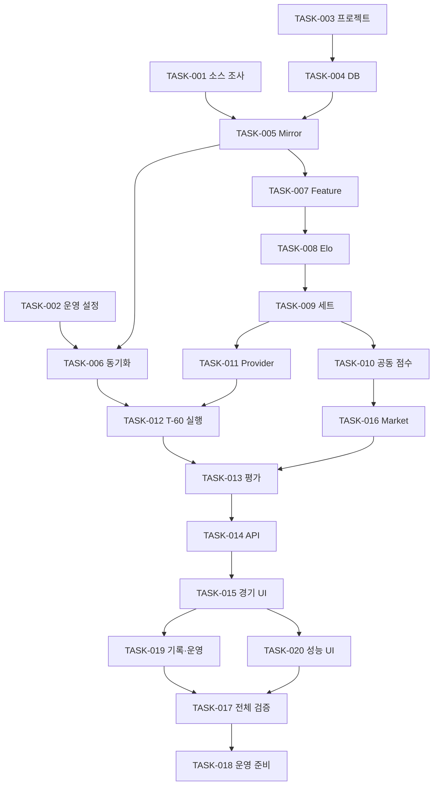

# 구현 작업 계획

작성일: 2026-09-20 · 최종 검증일: 2026-09-25 · 상태: TASK-001~020 구현 및 로컬 검증 완료, 외부 운영 게이트 미활성

## 적용 기준과 시작점

[design.md](design.md), [architecture.md](architecture.md), [user-confirm.md](user-confirm.md), [UI 기록](samples/README.md)·[선택된 디자인](samples/DESIGN.md)을 종합해 마지막으로 작성한 실행 계획이다. 아이디어 문서 2개 전체 분석과 UC-001~009 사용자 결정(원격 커밋 `8a242e2`)을 반영한다. UC-010 공개 전환은 Deferred다.

**첫 MVP는 전체 범위를 한 번에 제공한다.** 아래 작업 순서는 내부 개발 순서이며 MVP-0/MVP-1 분리 출시 승인이 아니다. 수집·Feature·Elo·세트/공동 점수 모델·독립 Multi-AI·네 예측·불변 저장·자동 평가·경기 중심 Web·기록/성능/운영 화면이 모두 완료되어야 한다. Market 계약과 합성 검증도 필수이며 실제 schema 전 `missing` 운영은 UC-005 C의 확정된 예외다. 점수 모델 미구현을 `unsupported`로 숨겨 MVP 완료로 간주하지 않는다.

TASK-001~020의 코드·계약·UI·운영 패키지를 구현했다. 합성·offline 범위와 clean PostgreSQL 17 재생 검증은 완료했으며 결과는 `docs/verification/mvp-report.md`에 기록한다. OP-001~005의 실제 데이터 접근, 유료 Provider 호출, Market adapter, live T-60 dry-run과 Docker host smoke는 외부 값이 준비될 때까지 fail-closed 상태다.

## 결정과 실행 의존

- UC-001~009: 모두 Confirmed. **Pending UC에 의한 차단은 없다.** 같은 선택을 다시 질문하지 않는다.
- OP-001~004·006: 구현 시 근거/값을 채워야 하는 항목. 해당 실데이터·유료 호출·live 작업만 차단한다.
- OP-005: 실제 Market adapter 연결에만 필요. 기본 missing adapter와 합성 계약은 지금 구현한다.
- UC-010: 공개 서비스 재개 시에만 검토한다. 개인용 MVP의 선행 조건이 아니다.

| 결정 | 반영 작업 |
|---|---|
| UC-001 전체 MVP | TASK-010·013~020을 포함한 전체 완료 판정 |
| UC-002 KOVO 직접 수집 | TASK-001·005·006 |
| UC-003 상시 Python/Postgres/React | TASK-002·003·004·014·018 |
| UC-004 단계 구현, 네 예측 완성 | TASK-007~010·013·016 |
| UC-005 Market missing 허용 | TASK-014~018·020 |
| UC-006 독립 Multi-AI | TASK-002·011·012·013·015 |
| UC-007 엄격 T-60/짧은 grace | TASK-002·007·012·013·017 |
| UC-008 sample2 주 방향 | TASK-015·019·020 |
| UC-009 대회/식별자/과거 시점 | TASK-001·005~009·013·020 |

## 실행 순서

도식은 주요 연결이며 상세 Dependencies가 기준이다. API/UI는 합성 응답으로 먼저 만들 수 있으나 해당 실 모듈 통합 전 완료로 표시하지 않는다. TASK-015 이후 TASK-019와 TASK-020은 서로 다른 feature 디렉터리에서 병행할 수 있다. 번호 019·020은 UI 작업을 적절한 크기로 나눈 안정된 ID이며 수치 순서대로 실행하라는 뜻이 아니다.

## 담당 모델 기준

사용자 요청에 따라 모든 작업의 개발 담당 모델을 `gpt-5.6-sol`로 통일한다. 기존 Astra 배정은 필수 의존성이 아니며, 기획·설계·계약과 검증 기준을 바탕으로 Sol이 작업을 수행한다. 추론 수준은 작업별로 유지한다. 일반 구성·조회 UI는 Medium, 시점·불변 저장·평가·복잡한 통합은 High, TASK-010 공동 점수 모델은 Extra High를 사용한다. 어려운 작업은 수식·계약 검토, 구현, 손계산 fixture·통합 검증 순서로 나누고 검증 실패를 해결한 뒤 완료 처리한다. 기존 Validation과 인수 조건을 그대로 적용한다. 이 표의 모델은 개발 담당이며 제품에서 호출할 GPT/Claude/Gemini model ID(OP-003)와 다르다.

각 작업은 산출물 검증 후 완료로 변경한다. 실패·미확인·외부 대기 상태는 근거와 함께 기록하고 건너뛰어 완료로 처리하지 않는다.

## TASK-001 — KOVO 소스와 사용 범위 확인

**Goal:** 실수집 전에 허용 범위와 데이터 계약을 증거로 확정한다.

**Dependencies:** 없음

**Scope:** 원문에 제시된 시즌·일정·상세 경로를 허용된 소량 조회로 확인한다. source ID 유일성, 남녀/대회 코드, 세트 점수, 선수 통계, 명단 공개 시점, 정정·429 동작을 표로 기록한다. 22시즌·4,460경기는 검증 대상이며 고정 합격값이 아니다. 세트별 선수 기록과 랠리는 가용성별로 분류한다.

**Files:** `docs/research/source-contract.md`, `docs/research/coverage.md`, `contracts/source/`, `fixtures/synthetic/`

**Validation:** 출처·확인일·허용 요청 정책·필수/선택/미확인 필드가 기록되어야 한다. 공개 fixture에는 실 Raw를 넣지 않는다. OP-001·006 미해결 범위를 명시한다.

**Agent:** Codex · **Model:** `gpt-5.6-sol` · **Reasoning Level:** High

**Reason:** 근거 수집과 계약 비교가 주 업무이며 임의 추측을 피해야 한다.

**실행 조건:** 없음. 대량 수집은 이 작업의 확인 결과가 나온 뒤 TASK-006에서만 활성화.

## TASK-002 — 운영 설정과 실험 계약 고정

**Goal:** 선택된 스택 안에서 실운영에 필요한 설정 값을 기록한다.

**Dependencies:** 없음; 소스 요청 정책은 TASK-001 결과 반영

**Scope:** 상시 호스트 후보·인증·백업/복구·알림을 정리하고 비용이 드는 선택만 사용자와 확정한다. 각 Provider의 실제 model ID와 버전·일/월 예산·토큰/호출 한도를 기록한다. T-60 기준 짧은 grace, 요청 timeout·재시도·완료 deadline, 최종 결과 안정화와 정정 재조회 기간을 수치화한다. 미설정 값은 실운영 시작 시 fail-fast하며 T-10을 기본값으로 넣지 않는다.

**Files:** `docs/operations/configuration.md`, `contracts/config.schema.json`, `config/example.toml`

**Validation:** OP-002·003·004별 값·출처·결정일·검증 방법이 존재한다. 예시 설정은 가짜 키만 사용하고 실제 secret은 외부 저장소에서 주입한다. grace가 경기 시작을 넘을 수 없는 검증을 정의한다.

**Agent:** Codex · **Model:** `gpt-5.6-sol` · **Reasoning Level:** High

**Reason:** 운영 비용과 시점 공정성의 영향을 함께 검토해야 한다.

**실행 조건:** 실제 호스트 비용·활성 모델·예산·시간 정책 미설정은 해당 운영 활성화만 차단. UC 선택을 다시 묻지 않음.

## TASK-003 — 정식 프로젝트와 검증 환경 구성

**Goal:** 선택된 Python/FastAPI·React/TypeScript 프로젝트를 빌드 가능하게 만든다.

**Dependencies:** 없음; TASK-002와 병행 가능

**Scope:** backend, frontend, contracts, fixtures, infra 구조를 만들고 지원 런타임·패키지 버전과 lockfile을 고정한다. API와 worker entrypoint를 분리하되 같은 backend artifact를 사용한다. lint·typecheck·unit test·frontend build 명령과 로컬 Postgres 환경을 구성한다.

**Files:** `backend/pyproject.toml`, `backend/src/vlytics/`, `frontend/package.json`, `frontend/src/`, `infra/compose.yaml`, `.gitignore`, `.github/workflows/ci.yml`

**Validation:** 깨끗한 환경에서 문서화된 install/build/test 명령 통과. API health 및 빈 worker 기동 확인. .env·raw·DB dump·모델 원문이 Git 대상에서 제외됨.

**Agent:** Codex · **Model:** `gpt-5.6-sol` · **Reasoning Level:** Medium

**Reason:** 스택이 확정되어 기계적인 구성과 빌드 연결이 중심이다.

**실행 조건:** 없음. 호스트 구매나 실제 서비스 배포는 포함하지 않음.

## TASK-004 — 저장 스키마와 불변 제약 구현

**Goal:** 관측·예측·평가·작업 데이터를 분리하고 DB에서 불변성을 강제한다.

**Dependencies:** TASK-003; 필드 확정은 TASK-001 계약 반영

**Scope:** architecture의 mirror/engine/market/ops 스키마, PK/FK/unique/index와 migration을 만든다. Raw·Feature·Prediction·Evaluation은 append-only, job lease와 projection은 갱신 가능하게 분리한다. prediction_events로 void/supersede 처리한다. 외부 호스트 관측 데이터와 내부 UUID를 분리한다.

**Files:** `backend/migrations/`, `backend/src/vlytics/*/repositories/`, `backend/tests/integration/test_immutability.py`

**Validation:** migration up/재적용 실패 방지, PK/source 중복, 실제 서비스 역할 UPDATE·DELETE 거부, 허용된 job 상태 갱신을 DB 통합 테스트로 증명한다.

**Agent:** Codex · **Model:** `gpt-5.6-sol` · **Reasoning Level:** High

**Reason:** 시점·정정·동시성 제약이 이후 모든 모듈의 신뢰도를 결정한다.

**실행 조건:** 없음. 실데이터가 없어도 합성 DB 테스트 가능.

## TASK-005 — V-Mirror parser와 식별자 관리

**Goal:** 원본을 잃지 않고 시즌·팀·선수·경기·세트 사실을 적재한다.

**Dependencies:** TASK-001, TASK-004

**Scope:** 응답 원문/해시/관측 시각 저장 후 parser version으로 정규화한다. 팀명 대신 source code와 season identity를 사용하고 검증된 franchise mapping, 경기별 venue, roster revision을 적용한다. 세트별 팀 점수와 경기별 선수 통계에서 시작하고 미지원 필드를 0으로 만들지 않는다.

**Files:** `backend/src/vlytics/mirror/`, `contracts/source/`, `backend/tests/contract/`, `fixtures/synthetic/`

**Validation:** 동일 응답 반복 수집은 사실 revision 중복 없음, 관측 receipt 보존. source key 선행 0·개명·이적·정정·필수 필드 누락·불완전 세트 사례 검증. OP-006 근거 없는 자동 병합 없음.

**Agent:** Codex · **Model:** `gpt-5.6-sol` · **Reasoning Level:** High

**Reason:** 계약은 정해져 있으나 오래된 기록과 식별자 예외가 많다.

**실행 조건:** OP-006 미확인 매핑은 해당 팀·기간을 격리; parser 전체 작업은 진행 가능.

## TASK-006 — Backfill과 현재 시즌 동기화

**Goal:** 중단·재개 가능한 적재와 coverage 보고를 제공한다.

**Dependencies:** TASK-005, TASK-002

**Scope:** 시즌·대회별 cursor/checkpoint, 요청 제한·Retry-After·backoff, 소량 검증 후 batch backfill을 구현한다. 현재 일정·최종 결과·정정 재조회 작업을 구성한다. 예상 경기 목록과 적재/누락/미지원 건수를 대조한다.

**Files:** `backend/src/vlytics/mirror/backfill.py`, `backend/src/vlytics/ops/sync.py`, `docs/operations/coverage-report.md`

**Validation:** 실행 중 중단 후 재개해도 중복 경기 없음. 원천 시즌별 일정과 적재 수 reconcile, 누락은 사유별 보고. 관측 시각을 과거 날짜로 소급하지 않음.

**Agent:** Codex · **Model:** `gpt-5.6-sol` · **Reasoning Level:** Medium

**Reason:** 영속 체크포인트와 수집 실패 처리의 명확한 구현 작업이다.

**실행 조건:** Blocked By: OP-001 허용 범위·요청량 확인. 합성 수집기 검증은 차단하지 않음.

## TASK-007 — Feature 계약과 시점 고정 계산

**Goal:** 누수 없이 경기·팀·선수·세트 Feature를 생성한다.

**Dependencies:** TASK-005; 실제 계산 검증은 TASK-006

**Scope:** Feature별 수식·분모·window·최소 표본·결측 사유를 계약으로 고정한다. 최근 5/10경기·최근 N세트·시즌 성적·홈/원정·상대전적·공격 효율·서브/블로킹/리시브/범실·선수 공격 점유율과 최근 변화량을 가용한 필드로 계산한다. 원천 의미 미확인 지표는 unknown. 값과 lineage를 함께 고정한다.

**Files:** `contracts/feature-v1.schema.json`, `backend/src/vlytics/engine/features/`, `backend/tests/unit/test_as_of.py`

**Validation:** cutoff 직전/직후·정정 revision·현재 누적 기록·대상 경기 출전자 주입을 검사한다. 분모 0·짧은 시즌·결측을 손계산 fixture와 대조. reconstruction과 strict/live 입력 policy 분리.

**Agent:** Codex · **Model:** `gpt-5.6-sol` · **Reasoning Level:** High

**Reason:** 가용시각과 경기시간 차이, 통계 분모가 데이터 누수에 직결된다.

**실행 조건:** OP-006 미확인 자료는 strict 평가에 편입하지 않음.

## TASK-008 — Elo와 홈 승률 기준선 구현

**Goal:** 승패 예측의 재현 가능한 비교 기준을 만든다.

**Dependencies:** TASK-007

**Scope:** 남녀별 Elo, 시즌 간 회귀·구단 이월·홈 어드밴티지와 훈련 기간 홈 승률을 구현한다. 파라미터 탐색은 훈련/검증 구간만 사용하고 독립 test 구간에 walk-forward 적용한다. 피드백의 K=32·홈 +15·회귀 0.5는 재현 후보로 비교한다.

**Files:** `backend/src/vlytics/engine/predictors/elo.py`, `backend/src/vlytics/engine/experiments/`, `docs/experiments/baselines.md`

**Validation:** 동일 입력·seed·버전으로 같은 예측을 생성한다. Elo 업데이트 및 시즌 회귀 손계산 검증, test 구간 재튜닝 방지, Brier·Log Loss·coverage 보고. 63.6% 재현 실패를 숨기거나 합격값에 맞춰 조정하지 않음.

**Agent:** Codex · **Model:** `gpt-5.6-sol` · **Reasoning Level:** High

**Reason:** 정해진 수식 구현과 시간 순 검증을 함께 수행한다.

**실행 조건:** 없음. 실자료가 준비되지 않으면 합성 수학 검증까지 진행.

## TASK-009 — 6범주 세트 확률 모델 구현

**Goal:** 세트스코어와 승패·세트 시장의 일관된 기반을 제공한다.

**Dependencies:** TASK-008

**Scope:** 1~4세트 p와 5세트 p5를 추정하는 설명 가능한 모델부터 만든다. 여섯 결과를 고정 순서로 출력하고 승패를 주변화한다. 남녀 분리 학습·버전·모델 capability를 저장한다. 독립 세트 가정의 오차를 기록한다.

**Files:** `backend/src/vlytics/engine/predictors/sets.py`, `contracts/prediction-v1.schema.json`, `backend/tests/unit/test_set_distribution.py`

**Validation:** p 경계·대칭·6개 확률 합=1, 승패 일치. 순차 holdout에서 RPS·Calibration·세트스코어 적중률과 n 보고.

**Agent:** Codex · **Model:** `gpt-5.6-sol` · **Reasoning Level:** High

**Reason:** 모델 가정과 분포 일관성을 해석하고 검증해야 한다.

**실행 조건:** 없음. UC-004 A에 따른 내부 개발 단계이며 별도 축소 출시가 아님.

## TASK-010 — 공동 점수 분포와 네 예측 역량 완성

**Goal:** 총점과 득실차를 모두 모델링하여 네 종류 예측을 완성한다.

**Dependencies:** TASK-009

**Scope:** 유효한 세트 점수 생성/조건부 모델로 P(set_score, home_points, away_points)를 구성한다. 일반 세트/최종 세트·듀스·시즌 규칙을 반영한다. 동일 공동분포에서 승패·세트·총점·득실차를 주변화하고 Monte Carlo seed·표본·꼬리 오차를 기록한다. 총점만으로 점수 handicap을 추정하지 않는다.

**Files:** `backend/src/vlytics/engine/predictors/points.py`, `contracts/joint-score-v1.schema.json`, `backend/tests/unit/test_score_distribution.py`

**Validation:** 질량 합·불가능한 스코어 거부·세트 주변분포 일치·듀스 꼬리 처리·점수 핸디캡/총점 판정 손계산 검증. 남녀 holdout의 분포 품질·제약·표본 수 보고.

**Agent:** Codex · **Model:** `gpt-5.6-sol` · **Reasoning Level:** Extra High

**Reason:** 공동 확률·배구 종료 규칙·수치오차를 함께 설계하는 가장 복잡한 모델 작업이다.

**실행 조건:** 없음. 이 작업을 생략한 상태는 전체 MVP 완료가 아님.

## TASK-011 — 독립 Multi-AI Provider와 출력 검증

**Goal:** GPT·Claude·Gemini를 같은 입력으로 실행하고 실패·비용까지 기록한다.

**Dependencies:** TASK-007, TASK-009; 점수 역량 연결은 TASK-010

**Scope:** 공통 PredictionProvider와 세 adapter, 구조화 출력·요청/응답 원문 해시·모델 버전·사용량·지연을 구현한다. 검색/도구/Market 입력을 차단한다. 소수 고정 variant를 사용하고 AI 확률과 통계 기반 파생분포의 출처를 구분한다. Refusal/timeout/잘못된 합·NaN/alias drift는 별도 실패 상태다.

**Files:** `backend/src/vlytics/engine/providers/`, `contracts/prediction-v1.schema.json`, `config/variants.toml`, `backend/tests/contract/test_providers.py`

**Validation:** 가짜 세 adapter에 동일 Snapshot/hash 전달, 한 Provider 실패 중 다른 결과 유지, 비용 cap, 무효 JSON 거부. 유효한 실제 설정 후 소량 smoke test의 요청 ID·모델 ID·사용량 기록. 과거 호출 결과를 예측력 증거로 사용하지 않음.

**Agent:** Codex · **Model:** `gpt-5.6-sol` · **Reasoning Level:** High

**Reason:** 다른 Provider의 응답·오류 계약을 동일한 경계에서 구현한다.

**실행 조건:** Blocked By: OP-003은 실제 유료 호출에만 적용. fake adapter 구현·계약 검증은 진행.

## TASK-012 — T-60 스케줄러와 불변 예측 실행

**Goal:** 일정 기반으로 정시 입력과 모델 결과를 중복 없이 저장한다.

**Dependencies:** TASK-004, TASK-006, TASK-007, TASK-011

**Scope:** DB job key/lease·재시도·재시작 복구를 구현한다. cutoff 전에 주기적으로 원천을 동기화하고 T-60에 동일 입력을 고정한다. strict grace 내 성공을 저장하고 지연 완료·연기·취소·앞당김을 이벤트로 남긴다. 성공 Provider 재호출과 응답 덮어쓰기를 방지한다.

**Files:** `backend/src/vlytics/ops/scheduler.py`, `backend/src/vlytics/engine/orchestrator.py`, `backend/tests/integration/test_schedule_replay.py`

**Validation:** fake clock으로 0/다수 경기·동시 claim·lease 만료·timeout 늦은 응답·재편성 검증. 이후 데이터 유입 없음, 대표 성공 unique, 경기 시작 후 완료는 평가 제외, 각 예측 hash 불변.

**Agent:** Codex · **Model:** `gpt-5.6-sol` · **Reasoning Level:** High

**Reason:** 동시성·시간·외부 호출의 중복 비용과 결과 적격성을 통합해야 한다.

**실행 조건:** Blocked By: OP-004 미설정 시 live scheduler 활성화만 차단. T-10 기본 재시도 금지.

## TASK-013 — 결과 평가와 공정한 코호트 집계

**Goal:** 예측 성능과 누락을 동일 경기 기준으로 측정한다.

**Dependencies:** TASK-010, TASK-012; Market 정산 통합은 TASK-016

**Scope:** 결과 revision마다 새 평가를 만들고 binary Brier·Log Loss·세트 RPS·Calibration·적중률을 계산한다. 공통 경기 교집합의 AI−baseline 차이와 표준오차, 실패·누락 coverage를 제공한다. 남녀·대회·model/prompt/feature·live/reconstruction·시점 정책을 분리한다.

**Files:** `backend/src/vlytics/engine/evaluation/`, `contracts/performance-v1.schema.json`, `backend/tests/unit/test_metrics.py`

**Validation:** 손계산 데이터로 모든 지표·n0/n1·0/1 확률·push/void 분모 검증. 결과 정정 후 이전 평가 보존, 재실행 중복 없음. 각 모델 단독 n과 paired n 구별, 시장 없는 경기의 AI/stat 비교 유지.

**Agent:** Codex · **Model:** `gpt-5.6-sol` · **Reasoning Level:** High

**Reason:** 평가 분모·코호트 오염이 제품의 핵심 위험이다.

**실행 조건:** 없음. Market 실데이터가 없어도 통계·AI 평가 가능.

## TASK-014 — 조회 API와 운영자 접근 제어

**Goal:** 선택된 UI에 일관된 조회 계약과 운영 상태를 제공한다.

**Dependencies:** TASK-004, TASK-013

**Scope:** 경기 목록/상세, Prediction History, performance, operations API와 cursor pagination을 구현한다. 기간·남녀부·팀·Provider·Model·유형·Prompt Version을 필터에 반영한다. 인증된 재시도는 idempotency와 deadline을 검사하고 원문·키는 API에 노출하지 않는다.

**Files:** `backend/src/vlytics/api/`, `contracts/openapi.json`, `backend/tests/integration/test_api.py`

**Validation:** 401/403·잘못된 필터·cursor 중복/누락·UTC/KST 경계·빈 결과·부분 실패 검증. 서버가 집계 정책을 소유하며 모든 응답의 schema/평가 revision 추적 가능.

**Agent:** Codex · **Model:** `gpt-5.6-sol` · **Reasoning Level:** Medium

**Reason:** 명확한 읽기 계약을 서버·클라이언트 경계에 옮기는 작업이다.

**실행 조건:** 없음. fixture 기반 계약 테스트를 먼저 작성 가능.

## TASK-015 — 경기 분석 중심 React 화면 구현

**Goal:** 채택한 sample2의 경기별 비교 흐름을 실제 API에 연결한다.

**Dependencies:** TASK-003, TASK-014

**Scope:** samples/sample2와 samples/DESIGN.md를 기준으로 경기 선택·통계/GPT/Claude/Gemini 비교·세트/점수 분포·근거·위험·Snapshot·Market 패널을 만든다. 단위와 기준 시각·missing/unsupported/부분 실패를 표시한다. 나머지 시안의 스타일을 섞지 않는다.

**Files:** `frontend/src/features/matches/`, `frontend/src/components/`, `frontend/src/styles/`, `frontend/tests/match-flow.spec.ts`

**Validation:** 모바일/데스크톱, 키보드, loading/empty/error, 실패 Provider, 긴 이름·텍스트를 실제 API fixture로 검증. 시점·확률·모델 버전이 서버와 일치하고 합성 자료가 실제 데이터로 오인되지 않음.

**Agent:** Codex · **Model:** `gpt-5.6-sol` · **Reasoning Level:** High

**Reason:** 채택된 UX 의도와 다중 모델 상태를 접근 가능한 화면으로 옮긴다.

**실행 조건:** 없음. UC-008 B는 이미 확정.

## TASK-019 — 예측 기록과 운영 상태 화면 구현

**Goal:** 경기 중심 주 화면에서 과거 기록·실행 문제로 이동할 수 있게 한다.

**Dependencies:** TASK-014, TASK-015

**Scope:** 같은 디자인 토큰으로 History와 Operations route를 추가한다. History의 전체 필터·정렬·cursor·상세 복귀 상태를 유지하고 불변 Snapshot을 조회한다. 운영 화면은 동기화 시각·누락·실패·비용·마감 여부를 표시한다. 재시도 가능한 작업만 action을 제공한다.

**Files:** `frontend/src/features/history/`, `frontend/src/features/operations/`, `frontend/tests/history-operations.spec.ts`

**Validation:** 복합 필터 후 URL/뒤로가기 유지, n0, 부분 실패, 재시도 중복 방지, 마감 후 action 차단, 원문 비밀정보 미노출을 확인한다.

**Agent:** Codex · **Model:** `gpt-5.6-sol` · **Reasoning Level:** Medium

**Reason:** 계약이 확정된 필터·상태 중심 UI로 병렬 구현이 가능하다.

**실행 조건:** 없음. 실제 알림 채널 연결은 OP-002 범위.

## TASK-020 — 장기 성능 Dashboard 구현

**Goal:** 표본·기준선·불확실성이 함께 보이는 성능 탐색을 제공한다.

**Dependencies:** TASK-013, TASK-014, TASK-015

**Scope:** sample3의 평가 내용을 sample2 디자인 체계로 옮긴다. Accuracy·Brier·Log Loss·RPS·Calibration, 같은 경기 차이·CI·n, 실패/제외 수를 표시한다. 홈 승률·통계·가용 시장 기준선을 병기하고 버전·대회·남녀 필터를 제공한다.

**Files:** `frontend/src/features/performance/`, `frontend/tests/performance.spec.ts`

**Validation:** n0/n1·시장 missing·짝비교 표본 불일치·정정된 평가·모델별 버전 변경을 fixture로 확인. 차트 수치를 표/텍스트로도 접근 가능하고 클라이언트의 임의 재집계 없음.

**Agent:** Codex · **Model:** `gpt-5.6-sol` · **Reasoning Level:** High

**Reason:** 차트의 가독성과 통계적 해석을 동시에 보존해야 한다.

**실행 조건:** 없음. Market 실데이터 missing은 허용.

## TASK-016 — Market 계약과 후행 비교 구현

**Goal:** 실제 소스 부재에서도 네 예측의 라인 판정 계약을 검증한다.

**Dependencies:** TASK-010, TASK-004; 운영 연결은 TASK-012

**Scope:** 별도 MarketRepository/adapter와 immutable snapshot, moneyline/set/point handicap·total 계약을 구현한다. cutoff 가용성·단위·홈 부호·push/void·stale·unsupported를 검증한다. 합성 full-match 정수/반점 라인으로 모든 target을 검증하고 실 schema 전에는 MissingMarketAdapter를 기본 사용한다.

**Files:** `backend/src/vlytics/engine/market/`, `contracts/market-v1.schema.json`, `fixtures/synthetic/market/`, `backend/tests/unit/test_market.py`

**Validation:** 독립 예측 입력에 Market 없음. 홈 −1.5 세트 cover, 점수 handicap, 총점 O/U의 승/패/push·무효를 손계산과 대조. 늦게 수신된 quote 소급 사용 금지. 미지원 계약의 임의 정산 없음.

**Agent:** Codex · **Model:** `gpt-5.6-sol` · **Reasoning Level:** High

**Reason:** 외부 계약 경계와 정산 의미를 정확하게 구현해야 한다.

**실행 조건:** OP-005는 실제 소스 adapter 연결만 차단. 계약·합성 검증·missing 운영은 첫 MVP에 포함.

## TASK-017 — 전체 MVP 재생 검증과 수정

**Goal:** 한 흐름에서 수집부터 Web 평가까지 전체 범위의 동작을 증명한다.

**Dependencies:** TASK-006, TASK-010, TASK-012, TASK-013, TASK-014, TASK-015, TASK-016, TASK-019, TASK-020

**Scope:** 가상 clock과 합성 일정으로 정상/명단 미확정/원천 오류/Provider 부분 실패/연기/취소/결과 정정을 재생한다. 실제 승인된 소량 데이터의 parser/feature 검증과 fake Provider 결과를 연결한다. 기능 누락과 높은 위험 결함을 수정한다.

**Files:** `backend/tests/replay/`, `frontend/tests/e2e/`, `docs/verification/mvp-report.md`

**Validation:** FR-01~12별 증거 표, 네 예측 계산과 Market missing 계약 모두 통과. UPDATE/DELETE 거부, 기준시각 누수 0건, 중복 성공 0건, 실패 coverage 기록. backend 검사와 frontend production build·브라우저 접근성/반응형 확인.

**Agent:** Codex · **Model:** `gpt-5.6-sol` · **Reasoning Level:** High

**Reason:** 모듈 단위 성공과 실제 사용자 흐름의 차이를 통합 검증한다.

**실행 조건:** UC-010 공개 서비스는 제외. 실 Market 부재만으로 MVP 검증을 막지 않음.

## TASK-018 — 개인용 운영 배포 준비와 검증

**Goal:** 검증된 전체 MVP를 상시 운영할 수 있게 포장한다.

**Dependencies:** TASK-002, TASK-017

**Scope:** API/worker/DB 배포 설정·비공개 접근·secret 주입·백업 복구·시계 동기화·예산 초과·업그레이드/롤백 절차를 작성한다. 운영 활성화 전 설정 장부와 완전성 체크를 수행한다. 비용이 드는 리소스 생성이나 실제 배포 승인은 완성된 산출물에 대해 마지막에 받는다.

**Files:** `infra/`, `docs/operations/runbook.md`, `docs/operations/release-checklist.md`

**Validation:** 같은 이미지 API/worker 기동, DB migration·복구 drill, 재시작 후 중복 없음, 실전 dry-run 시점 검증, 알림 목적지·예산·coverage 확인. 공개 배포나 수익화를 수행하지 않음.

**Agent:** Codex · **Model:** `gpt-5.6-sol` · **Reasoning Level:** High

**Reason:** 운영 재현성과 복구 검증을 실제 환경에서 수행한다.

**실행 조건:** Blocked By: OP-001~004의 적용 조건과 필요한 실운영 접근 정보. UC-005 C의 missing은 허용.

## 최종 인수 조건

| 확인 항목 | 필수 증거 |
|---|---|
| 전체 사용자 흐름 | 경기 선택 → 네 예측·근거 → 불변 기록 → 최종 결과 → 모델 비교 |
| 데이터와 시점 | Raw/hash·revision·cutoff lineage, 정정 보존, reconstruction/live 분리 |
| 실패까지 포함한 운영 | 누락·부분 실패·마감 이후·취소·재편성·비용 초과 상태 |
| 통계와 AI 평가 | 같은 경기 기준선·n·확률 점수·세트 RPS·Calibration·짝비교 |
| 네 예측 역량 | 공동 점수 분포와 모든 target의 합성 라인 정산 증거 |
| Market 예외 | 실 schema 없으면 missing, 후행 비교 계약·fixture는 완성 |
| 개인용 접근과 복구 | 인증·시크릿 외부 주입·백업 복구·상시 worker 재기동 |
| 변경 검증 | 빌드·계약·DB 통합·시간 재생·브라우저 검증 보고서 |

과거 Elo 점수나 특정 개막일은 고정 합격 기준이 아니다. 실제 모델 성능과 live 가동 성과는 외부 운영 게이트가 해제된 뒤 측정한다. TASK-001~020의 구현 완료는 계약·코드·합성 fixture·clean PostgreSQL 재생·브라우저 흐름·운영 패키지의 검증으로 판정하며 세부 증거는 `docs/verification/mvp-report.md`를 기준으로 한다.

